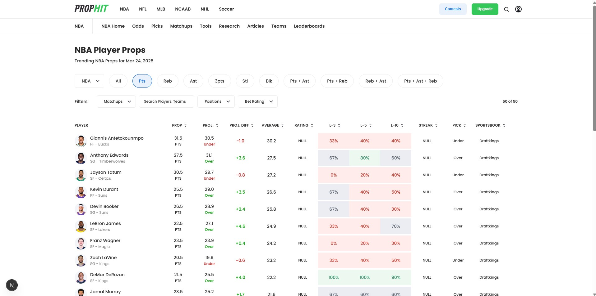

# **PropHit**

Welcome to **PropHit**, the ultimate sports betting analytics platform designed to help sports enthusiasts and bettors make informed decisions. Dive into player prop values, see projections, analyze advanced stats, and use our customizable algorithms to predict upcoming game outcomes. **This site is still a work in progress!**

<div align="center">

</div>


## 🚀 Features

- **Player Prop Values:** View daily prop values for NBA players (points, rebounds, assists) and analyze how often players hit on the over for these props.
- **Custom Algorithm Creation:** Build and refine your own algorithm to predict player prop outcomes. Adjust weights for various stats (season, weekly, home/away performance) to suit your betting strategy.
- **Player Statistics:** Access detailed player stats, including season averages, last 3/5/10 game stats, and performance against specific opponents.
- **Algorithm Sharing & Community:** Post your successful algorithms and see how well they perform. Algorithms with a success rate of over 50% will be featured on the platform. Users can download and tweak featured algorithms.
- **User Accounts:** Create an account to save your favorite players, track your performance, and access personalized analytics.

## 🔜 Upcoming Features

- **More Sports & Props:** Expand to additional sports and props (e.g., NFL, MLB, etc.).
- **Enhanced Algorithm Insights:** Get deeper insights into why certain algorithms are successful and how you can improve them.
- **Betting Trends:** View trends and historical performance data for props and players across multiple seasons.
- **Leaderboard:** Compete with other users by sharing your most accurate algorithms and betting success rate.
- **Betting Posts & Media Sharing:** Share your betting insights, algorithms, and media with the community.

## 📚 Getting Started

To get started with **PropHit**, clone the repository and follow the setup instructions in the [README](./README.md).

### Prerequisites

- Node.js

### Installation

1. Clone the repository:

   ```bash
   git clone https://github.com/your-username/prop-hit.git
